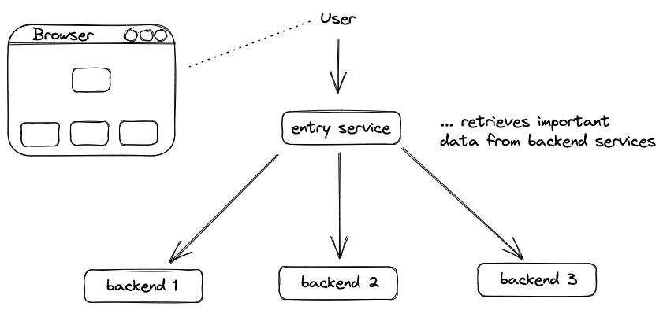

# Demo Go Microservice Delivery with Helm



    export GITHUB_TOKEN=<your-token>
    export GITHUB_USER=<your-username>


    flux check --pre


```bash
flux bootstrap github \
  --owner=$GITHUB_USER \
  --repository=fhb-mcce-aktt2-schuetz-k8s-helm \
  --branch=main \
  --path=./clusters/my-cluster \
  --personal
```
